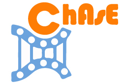 </img>

# ChAsE: Chromatin Analysis and Exploration Tool

ChAsE is a cross platform desktop application that provides an interactive graphical interface for analysis of epigenomic data. 

Features include:

* Exploration and visualization of the data using an interactive heat map and plot interface.
* Clustering the data automatically or manually by sorting and brushing the heat map.
* Set construction based on presence/absence of signal.
* Ability to compare different clusterings via set operations.
* Exporting results for downstream analysis or as high quality images for publications.

## Quick Start

### Installation
This software requires Java 7 or greater. It is recommended that you get the latest version of [Java SE](http://www.oracle.com/technetwork/java/javase/downloads/jdk8-downloads-2133151.html).

* Download and extract the [latest binary distribution] (https://github.com/hyounesy/ChAsE/raw/master/dist/ChAsE_1.1.0.zip) if you don't want to build it yourself:

  * **Windows**: Double click ```Run_Windows.bat```.
  * **Mac**: Right click ```Run_OSX.command``` and select Open. Confirm running the application.
  * **Linux**: Double click ```Run_Unix.sh```.
  * Or, you may open a console and run the following in the command-line: ``` java -jar chase.jar ```
  
### Example Data
* [Example Workspace](https://github.com/hyounesy/ChAsE/raw/master/dist/ExampleWorkspace.zip): Contains two preprocessed exmaple workspaces which can be readily opened using the [Open Existing Analysis] Option 
* [Example Data](https://github.com/hyounesy/ChAsE/raw/master/dist/ExampleData.zip): Contains an example GFF file (mm9) and four WIG files which can be used to create a new workspace from scratch.

## Video Walkthroughs
| | [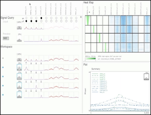](https://vimeo.com/69030501) Full Video Walkthrough| |
:--------:|:--------:|:--------:
[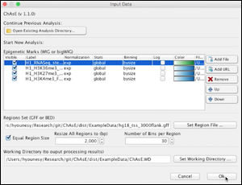](https://vimeo.com/157531803) Input: New Datasets | [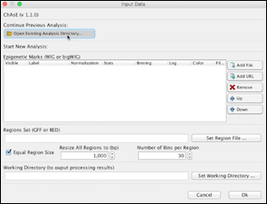](https://vimeo.com/157531804) Input: Open Workspace| [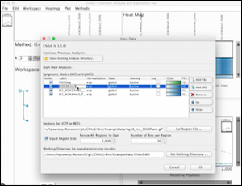](https://vimeo.com/157531802) Input: Modify Parameters
[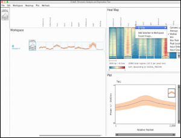](https://vimeo.com/157376716) Heatmap: Sorting| [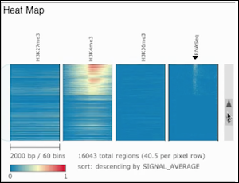](https://vimeo.com/157531800) Heatmap: Navigation | [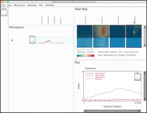](https://vimeo.com/157531801) Heatmap: Filtering
[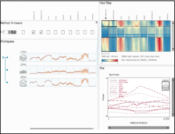](https://vimeo.com/157376752) Method: K-means| [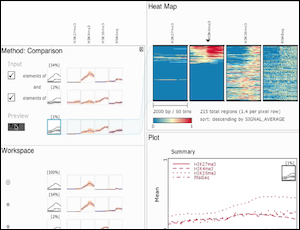](https://vimeo.com/157531799) Method: Cluster Comparison| [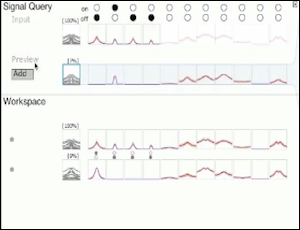](https://vimeo.com/158296729) Method: Signal Query

## Credits
ChAsE is developed by [Hamid Younesy](https://www.researchgate.net/profile/Hamid_Younesy) under the supervision of [Torsten Möller](https://cs.univie.ac.at/vda-team/infpers/Torsten_M%C3%B6ller/), and in close collaboration with [Cydney Nielsen](http://www.cydney.org/).

Special thanks to [Mohammad Karimi](http://brc.ubc.ca/research/computational-biology-and-bioinformatics/), [Matthew Lorincz](http://medgen.med.ubc.ca/person/matthew-lorincz/), [Rebecca Cullum](http://www.terryfoxlab.ca/people-detail/rebecca-cullum/), [Olivia Alder](https://www.researchgate.net/profile/Olivia_Alder), [Bradford Hoffman](https://cfri.ca/our-research/researchers/results/Details/brad-hoffman) and [Arthur Kirkpatrick](http://www.cs.sfu.ca/~ted/) for their feedback and help evaluating this tool.
